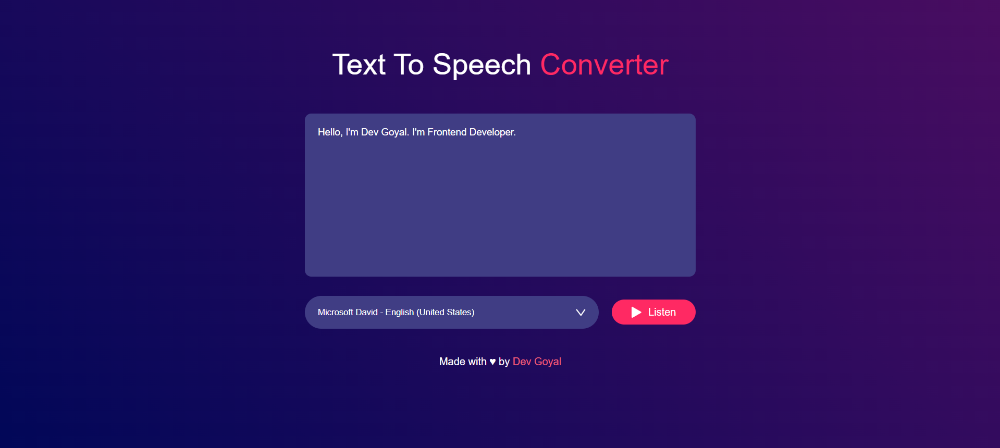

[](https://github.com/DevGoyalG)
[](https://github.com/DevGoyalG?tab=repositories)


<h1 align="center"> Text To Speech Converter </h1>

<p align="center"> <b> If you found this repository helpful, give us a  ⭐️ </b> </p>
<p align="center"></a> </p>

A simple project that converts text into speech. The user inputs text, and with a click of a button, the application reads the text aloud using the browser's built-in text-to-speech functionality. It's designed to be intuitive and user-friendly.

## 🌐 Live Demo
Check out the live demo of the Text to Speech Converter [here](https://text-speech-converters.netlify.app/).

## 📸 Project Preview
Here's a sneak peek of the Text to Speech Converter application:



## 🚀 Features
- Converts any input text into speech.
- Allows the user to choose from different voices (if supported by the browser).
- Provides control for play/pause functionality.
- Adjusts the speech rate and pitch for a customized experience.

## 🛠️ Tech Stack
- **HTML** : For the structure of the text input form and controls.
- **CSS** : For styling the page and creating a clean interface.
- **JavaScript** : For handling the text-to-speech conversion using the Web Speech API.

## 🧑‍💻 Getting Started

Follow the steps below to clone and use the project locally:

### 1. Prerequisites
Make sure you have **Git** installed. If not, you can download it [here](https://git-scm.com/).

### 2. Clone the Repository
```bash
git clone https://github.com/Tejaswinikarri1/Text-To-Speech-Converter.git
```

## 🤝 Contributing
Contributions are welcome! If you have suggestions or want to report an issue, feel free to open an issue or create a pull request.

## 👨‍💻 Created by
This project was created and is maintained by:
**Tejaswini Reddy**

Feel free to reach out if you have any questions or suggestions! ❤️
